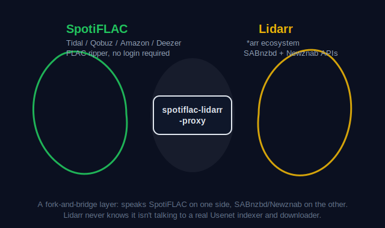

<p align="center">
  
</p>

<h1 align="center">Spotiflac-Lidarr Proxy</h1>

<p align="center">
  <a href="https://github.com/fishingpvalues/spotiflac-lidarr-proxy/actions/workflows/ci.yml"></a>
  <a href="LICENSE"></a>
  <a href="go.mod"></a>
  <a href="https://github.com/fishingpvalues/spotiflac-lidarr-proxy/pkgs/container/spotiflac-lidarr-proxy"></a>
</p>

<p align="center">
  You run Lidarr. You've heard of SpotiFLAC. Now they can talk to each other.
</p>

> [!WARNING]
> Use this only to download content you have the legal right to download. See [Legal](#legal) for the full disclaimer.

This proxy makes [SpotiFLAC](https://github.com/spotbye/SpotiFLAC) speak Lidarr's language. It implements the SABnzbd download-client API and the Newznab indexer API, so Lidarr believes it is talking to an ordinary Usenet setup. Underneath, it shells out to a headless SpotiFLAC CLI that pulls FLAC and hi-res audio from Tidal, Qobuz, Amazon Music, and Deezer using Spotify links as the search key.

No account or credentials are needed for any of the four backing services. SpotiFLAC works by reverse-engineering public APIs, not by logging in anywhere.

## How it fits together

<p align="center">
  
</p>

Two ecosystems that were never meant to talk to each other, connected at the one point Lidarr already knows how to speak: the SABnzbd and Newznab protocols. Lidarr's indexer and download-client screens see a normal Usenet setup. On the other side, the proxy drives the SpotiFLAC CLI directly.

<details>
<summary>Full technical diagram</summary>

```
                                   Lidarr
  ┌─────────────────────────────────────────────────────────────────────┐
  │  ┌──────────────────────┐         ┌──────────────────────────────┐  │
  │  │  Download Client      │         │  Indexer                     │  │
  │  │  (SABnzbd mode)       │         │  (Newznab mode)              │  │
  │  └──────────┬───────────┘         └──────────────┬───────────────┘  │
  └─────────────┼────────────────────────────────────┼──────────────────┘
                │                                     │
        ┌───────▼─────────────────────────────────────▼────────────────┐
        │               spotiflac-lidarr-proxy                          │
        │                                                               │
        │  ┌─────────────────────────┐    ┌──────────────────────────┐  │
        │  │  /api (SABnzbd)         │    │  /api/newznab             │  │
        │  │  /api/sabnzbd           │    │                          │  │
        │  │                         │    │  t=caps → capabilities   │  │
        │  │  mode=version           │    │  t=search → Spotify      │  │
        │  │  mode=auth              │    │  t=music → album search  │  │
        │  │  mode=get_config        │    │  t=details → item info   │  │
        │  │  mode=get_cats          │    │                          │  │
        │  │  mode=fullstatus        │    └──────┬───────────────────┘  │
        │  │  mode=addurl/addfile    │           │                      │
        │  │  mode=queue             │    ┌──────▼───────────────────┐  │
        │  │  mode=history           │    │  internal/indexer/        │  │
        │  │  mode=retry             │    │  Spotify search → XML    │  │
        │  │  mode=delete            │    └──────────────────────────┘  │
        │  │  mode=pause/resume      │                                  │
        │  │  mode=change_cat        │    ┌──────────────────────────┐  │
        │  │  mode=server_stats      │    │  Job Queue (SQLite)       │  │
        │  │  mode=status            │    │  ┌─────┐ ┌─────┐ ┌────┐ │  │
        │  │  mode=warnings          │    │  │ J1 │ │ J2 │ │ J3 │ │  │
        │  │  mode=pause_all         │    │  └──┬──┘ └──┬──┘ └──┬──┘ │  │
        │  │  mode=resume_all        │    │     │       │       │    │  │
        │  │  mode=set_speedlimit    │    │     ▼       ▼       ▼    │  │
        │  └─────────────────────────┘    │  ┌────────────────────┐  │  │
        │                                  │  │  SpotiFLAC CLI    │  │  │
        │                                  │  │  (subprocess)     │  │  │
        │                                  │  │                    │  │  │
        │                                  │  │  --url <spotify>   │  │  │
        │                                  │  │  --service tidal   │  │  │
        │                                  │  │  --quality lossless│  │  │
        │                                  │  │  --output-dir <dir>│  │  │
        │                                  │  └────────┬───────────┘  │  │
        │                                  │           │              │  │
        │                                  │    ┌──────▼──────────┐   │  │
        │                                  │    │ Tidal / Qobuz    │   │  │
        │                                  │    │ Amazon / Deezer  │   │  │
        │                                  │    └──────┬──────────┘   │  │
        │                                  │           │              │  │
        │                                  │    ┌──────▼──────────┐   │  │
        │                                  │    │  FLAC files      │   │  │
        │                                  │    │  → /downloads/   │   │  │
        │                                  │    └─────────────────┘   │  │
        │                                  └──────────────────────────┘  │
        └────────────────────────────────────────────────────────────────┘
                          │
                   ┌──────▼──────────────────────────────────────────────┐
                   │  Lidarr Import                                      │
                   │  Lidarr scans /downloads/, imports FLAC, renames,    │
                   │  tags, and organizes into your music library         │
                   └─────────────────────────────────────────────────────┘
```

</details>

## Features

- Speaks both halves of Lidarr's expected protocol: SABnzbd (download client) and Newznab (indexer).
- Quality- and service-based categories (`music-flac-24`, `music-tidal`, `music-qobuz-flac-24`, ...), so Lidarr's quality profiles map directly onto SpotiFLAC's service/quality flags.
- Verifies each download actually completed (event signal plus a file-count check against expected track count) before reporting success to Lidarr.
- Per-service circuit breaker: a service that keeps failing gets skipped automatically instead of retried forever.
- Optional fallback chain: if the primary service fails, try the next configured one.
- Prometheus `/metrics`, a real `/health` check, and a `warnings` endpoint that surfaces open circuit breakers and stuck jobs.
- SQLite-backed job queue that survives restarts.

## Quick start

For the lazy: clone, set one environment variable, and go.

```bash
git clone https://github.com/fishingpvalues/spotiflac-lidarr-proxy.git
cd spotiflac-lidarr-proxy
cp .env.example .env
# edit .env and set SPF_API_KEY to a random string
docker compose up -d
```

This builds the proxy and starts it alongside a Lidarr container on the same Docker network, sharing a `/downloads` volume.

Prefer a prebuilt image over building locally:

```yaml
services:
  proxy:
    image: ghcr.io/fishingpvalues/spotiflac-lidarr-proxy:latest
    ports: ["8484:8484"]
    environment:
      - SPF_API_KEY=your-secret-key
      - SPF_OUTPUT_DIR=/downloads
    volumes:
      - downloads:/downloads
  lidarr:
    image: lscr.io/linuxserver/lidarr:latest
    ports: ["8686:8686"]
    environment:
      - PUID=1000
      - PGID=1000
    volumes:
      - downloads:/downloads
      - config:/config
```

### Lidarr setup

1. **Download Client:** Settings -> Download Clients -> Add -> SABnzbd
   - Host: `proxy`, Port: `8484`
   - URL Base: leave empty
   - API Key: your `SPF_API_KEY` value
   - Category: `music`

2. **Indexer:** Settings -> Indexers -> Add -> Newznab
   - URL: `http://proxy:8484/api/newznab`
   - API Key: your `SPF_API_KEY` value
   - Categories: 3010, 3040

## Running the binary directly

The Docker image is the recommended way to run this in production - it bundles
a matching `spotiflac-cli` build alongside the server. If you'd rather run the
server binary directly on the host (no container), grab a prebuilt release:

```bash
# Linux/macOS
curl -L -o spotiflac-lidarr-proxy.tar.gz \
  https://github.com/fishingpvalues/spotiflac-lidarr-proxy/releases/latest/download/spotiflac-lidarr-proxy_<tag>_<os>_<arch>.tar.gz
tar xzf spotiflac-lidarr-proxy.tar.gz

# verify against the published checksums
curl -L -o checksums.txt \
  https://github.com/fishingpvalues/spotiflac-lidarr-proxy/releases/latest/download/checksums.txt
sha256sum --ignore-missing -c checksums.txt
```

Every [GitHub Release](https://github.com/fishingpvalues/spotiflac-lidarr-proxy/releases)
is built straight from the pushed git tag (`vX.Y.Z`) and ships binaries for
`linux`, `darwin` and `windows` on `amd64`/`arm64`, plus a `checksums.txt` and
an auto-generated changelog grouped by commit type. Pick the archive matching
your OS/arch (e.g. `spotiflac-lidarr-proxy_v1.3.2_linux_amd64.tar.gz`,
`..._windows_amd64.zip`).

The binary alone only runs the proxy server - it still shells out to a
separate `spotiflac-cli` for the actual SpotiFLAC/Tidal/Qobuz downloading.
Build it from the pinned fork commit (see the [Dockerfile](Dockerfile) for the
exact commit and flags), then point the proxy at it:

```bash
git clone https://github.com/fishingpvalues/SpotiFLAC.git
cd SpotiFLAC && git checkout <commit-from-Dockerfile>
go build -tags headless -o spotiflac-cli .

SPF_API_KEY=your-secret-key \
SPF_OUTPUT_DIR=/path/to/downloads \
SPF_SPOTIFLAC_CLI_PATH=/path/to/spotiflac-cli \
./spotiflac-lidarr-proxy serve
```

`serve --help` lists all flags; every flag has a matching `SPF_*` environment
variable (see [Configuration](#configuration) below).

## Build from source

Requires Go 1.25+ and a SpotiFLAC CLI build (see the [Dockerfile](Dockerfile) for the exact pinned commit and build flags).

```bash
git clone https://github.com/fishingpvalues/spotiflac-lidarr-proxy.git
cd spotiflac-lidarr-proxy
go build ./cmd/server
./server serve
```

Run the test suite with `go test ./... -count=1`. `INTEGRATION=1 go test ./tests/integration/... -v` runs the docker-compose-backed integration test.

Cross-compiling for a release build (matches what CI publishes): `goreleaser release --snapshot --clean --skip=publish` (requires [GoReleaser](https://goreleaser.com/)).

## Configuration

The essentials, via environment variables prefixed `SPF_`. Full reference: [`docs/API.md`](docs/API.md).

| Variable | Default | Description |
|----------|---------|-------------|
| `SPF_PORT` | 8484 | HTTP listen port |
| `SPF_API_KEY` | (required) | API key for Lidarr auth |
| `SPF_OUTPUT_DIR` | /downloads | FLAC output directory |
| `SPF_DEFAULT_SERVICE` | tidal | Download service |
| `SPF_DEFAULT_QUALITY` | lossless | Quality: lossless, hires |
| `SPF_FALLBACK_SERVICES` | (none) | Services to try, in order, if the primary fails |
| `SPF_MAX_CONCURRENT` | 3 | Max concurrent downloads |
| `SPF_DB_PATH` | /data/queue.db | SQLite database path |

## Security and hardening

This proxy authenticates every request with a single static API key. That is the same trust model SABnzbd, Prowlarr, and every other download client Lidarr talks to already use, but it means the proxy is only as safe as the network it sits on.

**We are aware of the Huntarr incident.** In early 2026, a widely used *arr-stack management tool shipped unauthenticated endpoints that dumped every connected app's API keys and instance URLs in plaintext to anyone who could reach it. The lesson from that incident drove real decisions in this codebase: the API key is compared in constant time, it is redacted before it ever reaches a log line, and every value that reaches the SpotiFLAC subprocess is validated against a strict allowlist first. None of that protects you if the *arr stack itself is reachable from the open internet. No download client can fix an exposed network.

Harden your deployment the same way you would harden Lidarr itself:

- **Never publish this proxy's port to the internet.** Keep it on the same internal Docker network as Lidarr; do not add a `ports:` mapping that exposes it beyond `localhost` unless a reverse proxy sits in front.
- **Put a reverse proxy in front if you need remote access**, terminating TLS there (Caddy, Traefik, nginx). The API key travels in the query string on every request; over plain HTTP on an untrusted network that is readable by anyone on-path.
- **Prefer a VPN over port-forwarding.** Tailscale or WireGuard into your home network, rather than opening a port on your router, removes an entire class of exposure. If you also want a kill switch for the underlying streaming traffic itself (in case of ISP-level blocking or to keep those connections off your home IP), run a VPN with kill-switch support (e.g. Gluetun) as a network sidecar for the SpotiFLAC-side traffic, the same pattern used by qBittorrent/Sonarr/Radarr stacks that route through NordVPN or PIA.
- **Rotate `SPF_API_KEY`** if you ever suspect it leaked, and check `GET /api/sabnzbd?mode=warnings` and `/metrics` periodically for anything that looks wrong.
- **Keep the image updated.** Renovate is configured on this repo to track dependency and base-image updates.

Example Caddy sidecar for TLS termination:

```yaml
services:
  caddy:
    image: caddy:2-alpine
    ports: ["443:443"]
    volumes:
      - ./Caddyfile:/etc/caddy/Caddyfile
    depends_on: [proxy]
```

```
# Caddyfile
proxy.yourdomain.com {
    reverse_proxy proxy:8484
}
```

## Troubleshooting

### Repeated download failures for one service (Tidal/Qobuz/Amazon/Deezer)

The most common real-world failure is IP-based rate limiting, not an authentication problem. SpotiFLAC's own project confirms metadata and audio fetches can get rate-limited per IP, and recommends waiting or using a VPN.

This proxy has a built-in per-service circuit breaker: after 5 consecutive failures for one service, it stops sending new jobs to that service for 10 minutes and fails them immediately instead of waiting out a full timeout. Check `GET /api/sabnzbd?mode=warnings` — an open breaker shows up there with the service name and retry time.

If one service's breaker keeps tripping, that service is likely rate-limiting you. Either wait it out or set `SPF_FALLBACK_SERVICES` so jobs automatically try another service.

## API reference

Full route tables, response field reference, and the category system: [`docs/API.md`](docs/API.md). Machine-readable spec: [`openapi.json`](openapi.json), checked against the running server on every CI run.

## AI usage

This project was planned and implemented with AI assistance (Anthropic Claude Code). All AI-generated code goes through automated tests and manual review before merging, the same as any other contribution. Nothing here is exempt from that bar because an AI wrote the first draft.

## Legal

SpotiFLAC and this proxy are third-party tools and are not affiliated with, endorsed by, or connected to Spotify, Tidal, Qobuz, Amazon Music, or any other streaming service. This project is for educational and private use only. The developer does not condone or encourage copyright infringement.

You are solely responsible for:
- Ensuring your use of this software complies with your local laws.
- Reading and adhering to the Terms of Service of the respective platforms.
- Any legal consequences resulting from misuse of this tool.

The software is provided "as is", without warranty of any kind. The author assumes no liability for any bans, damages, or legal issues arising from its use.

**API credits (from the upstream SpotiFLAC project):** [MusicBrainz](https://musicbrainz.org), [LRCLIB](https://lrclib.net), [Songlink/Odesli](https://song.link), [Songstats](https://songstats.com), [hifi-api](https://github.com/binimum/hifi-api), [Qobuz-DL](https://github.com/QobuzDL/Qobuz-DL).

## License

[Apache License 2.0](LICENSE).
