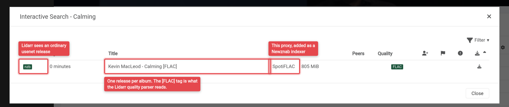
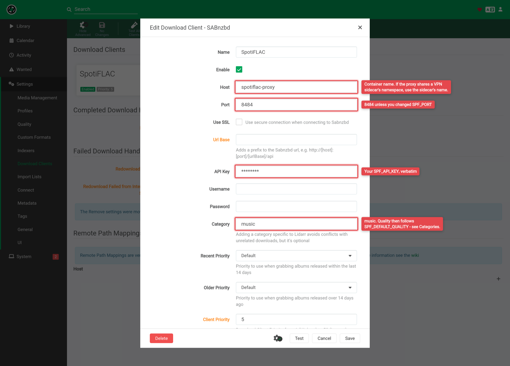
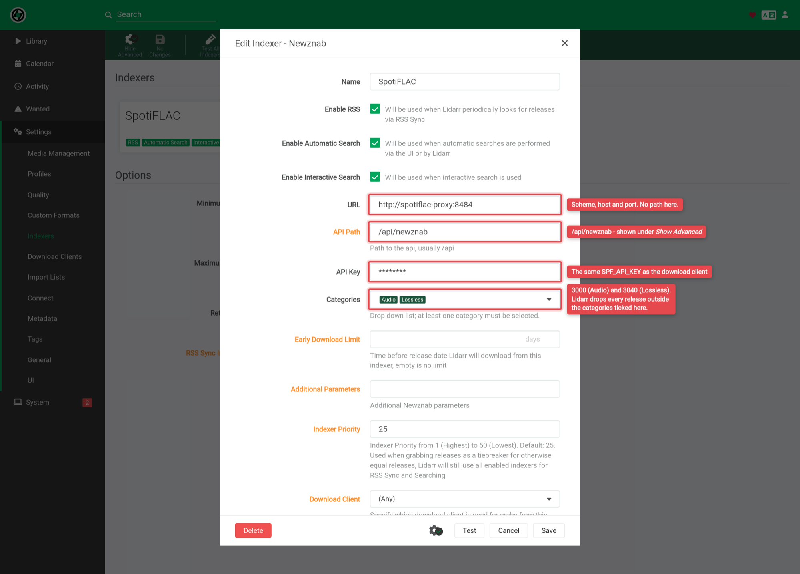

# spotiflac-lidarr-proxy

[](https://github.com/fishingpvalues/spotiflac-lidarr-proxy/releases)
[](https://github.com/fishingpvalues/spotiflac-lidarr-proxy/actions/workflows/ci.yml)
[](LICENSE)

Use [SpotiFLAC](https://github.com/fishingpvalues/SpotiFLAC) from
[Lidarr](https://lidarr.audio).

Lidarr speaks to Newznab indexers and SABnzbd clients. This implements both,
so Lidarr treats it as an ordinary Usenet setup. Behind that, SpotiFLAC
resolves a Spotify link to the same recording on Tidal, Qobuz, Amazon Music or
Deezer and downloads the FLAC. Spotify links are a search key; no account is
needed on any of the five services.



That is Lidarr's own interactive search. The release is an album on a
streaming service; this proxy is what makes it look like something Lidarr can
grab. (Screenshots use [Kevin MacLeod](https://incompetech.com), whose
catalogue is Creative Commons.)

Only download what you have the right to download. See [Legal](#legal).

## Install

```bash
docker run -d \
  -p 8484:8484 \
  --shm-size=512m \
  -e SPF_API_KEY=$(openssl rand -hex 16) \
  -v /srv/downloads:/downloads \
  -v spotiflac-data:/data \
  ghcr.io/fishingpvalues/spotiflac-lidarr-proxy:latest
```

The image contains the proxy, a matching `spotiflac-cli`, a Python environment
with the SpotiFLAC module, and the browser stack it drives (Chromium, Node.js,
Xvfb).

Run it on the same Docker network as Lidarr, with the same downloads volume
mounted at the same path in both. See [`docker-compose.yml`](docker-compose.yml).

Binaries for Linux, macOS and Windows on amd64 and arm64 are attached to each
[release](https://github.com/fishingpvalues/spotiflac-lidarr-proxy/releases)
with `checksums.txt`. Outside a container you supply `spotiflac-cli` yourself.

## Lidarr

Two entries, both using the same `SPF_API_KEY`. If the proxy shares a VPN
sidecar's network namespace, use the sidecar's name and published port.

Download client — Settings › Download Clients › Add › SABnzbd:

| Field | Value |
|-------|-------|
| Host / Port | `spotiflac-proxy` / `8484` |
| API Key | `$SPF_API_KEY` |
| Category | `music` |
| URL Base, Username, Password | empty |



Indexer — Settings › Indexers › Add › Newznab (Custom):

| Field | Value |
|-------|-------|
| URL | `http://spotiflac-proxy:8484` |
| API Path | `/api/newznab` |
| API Key | `$SPF_API_KEY` |
| Categories | `3000` and `3040` |



The Test button stays red until the browse feed has a query to run - see
[Indexer Test](#indexer-test). Directed searches work regardless.

### Categories

A category name is `music[-service][-quality]`, matched by substring. The
download client sends it with every job, and it is what selects the provider
and the bit depth.

| Category | Provider | Quality |
|----------|----------|---------|
| `music` | `SPF_DEFAULT_SERVICE` | `SPF_DEFAULT_QUALITY` |
| `music-flac-16`, `music-lossless` | `SPF_DEFAULT_SERVICE` | 16-bit |
| `music-flac-24` | `SPF_DEFAULT_SERVICE` | 24-bit |
| `music-tidal`, `music-qobuz`, `music-amazon`, `music-deezer` | that one | `SPF_DEFAULT_QUALITY` |
| `music-tidal-flac-24`, `music-qobuz-flac-16`, ... | that one | as named |

Any half you leave out falls back to the matching default, so `music` is the
whole setup for most people. `mode=get_cats` lists the full set.

`music-mp3` exists because Lidarr offers it; it downloads FLAC like the rest.
There is no lossy path.

Two things a category does not do. It does not pin the provider against
failure: a service that errors or refuses hands the job to
`SPF_FALLBACK_SERVICES` anyway, which is the behaviour you want and the reason
to set that variable. And it carries no directory - advertising one makes
Lidarr raise a permanent "this directory does not appear to exist" health
error, so every category here is directory-less and downloads land in
`SPF_OUTPUT_DIR`.

### Recommended settings

```
SPF_DEFAULT_SERVICE=tidal
SPF_DEFAULT_QUALITY=lossless
SPF_FALLBACK_SERVICES=qobuz,amazon,deezer
```

with `music` as the Lidarr download client category, and `FLAC` in the quality
profile.

For 24-bit, change `SPF_DEFAULT_QUALITY` to `hires` and add `FLAC 24bit` to
the profile above `FLAC`. Leave the category at `music`.

Set the quality on the variable, not on the category, because the two halves
of this proxy read different sources and only the variable moves both:

| | reads |
|---|---|
| what the indexer advertises - the `[FLAC]` / `[FLAC 24-bit]` tag in the release title, which is where Lidarr reads quality from | `SPF_DEFAULT_QUALITY` |
| what the download actually fetches | the client's category |

Lidarr grabs on the first and stores the second. Set the client category to
`music-flac-24` while `SPF_DEFAULT_QUALITY` stays `lossless` and every release
still advertises `[FLAC]`, so Lidarr scores 24-bit files as 16-bit and will
keep trying to upgrade them. Category `music` cannot drift that way.

`SPF_FALLBACK_SERVICES` is empty by default, which makes the primary service
the only one that is ever tried. Three names cost nothing and are what turns a
provider outage into a slower download instead of a failed one. Services the
running build cannot serve are dropped from the chain; without the Python
backend that is `deezer`.

### Indexer Test

Lidarr's Test button and its RSS sync both send `t=music` with no artist and no
album - a browse feed, which this indexer has no notion of (it resolves Spotify
metadata for a *named* album). With nothing to search for, it answers an empty
feed, and Lidarr reports that as

    Query successful, but no results in the configured categories were
    returned from your indexer.

`SPF_RSS_QUERY` gives the browse feed a search to run. [`docker-compose.yml`](docker-compose.yml)
ships `new music friday`, so a compose deployment is green out of the box;
every other deployment needs it set explicitly:

    SPF_RSS_QUERY="new albums"

Any query Spotify's search understands works. The results are ordinary album
releases, so Lidarr ignores every one that does not match an album it is
monitoring. Leave it empty to keep RSS sync silent and accept a red Test -
directed searches and grabbing work either way.

### Albums, not tracks

Lidarr rejects an album match below 80%. An album hit wins its
`(artist, album)` pair and the track hits under it are dropped. Singles are
still published.

### Priorities

This speaks the Usenet protocol and competes with your Usenet clients. Lower
wins: real Usenet client `1`, this `5`, torrents last.

## How it works

Four backends, tried in order, first success wins.

| # | Backend | Requires | Interaction |
|---|---------|----------|-------------|
| 1 | SpotiFLAC Python module + bundled Chromium | writable `$HOME` | none |
| 2 | `spotiflac-cli` against a custom Tidal/Qobuz API | `SPF_TIDAL_API_URL` or a live mirror | none |
| 3 | `spotiflac-cli` with a captcha solver | `SPOTIFLAC_FSL_URL` | none |
| 4 | `spotiflac-cli` against the community tier | nothing | none with `SPF_SESSION_RENEW_CMD` |

Backend 1 authenticates itself and needs no captcha or third-party mirror.
The others exist because upstream sources fail often and independently.

Jobs are stored in SQLite and survive restarts. Completion is checked against
the files on disk. An open circuit breaker, an announced upstream break and a
429 all park the job in `Queued` rather than failing it, because a failed job
leaves Lidarr's history and only a fresh search brings it back.

See [`docs/OPERATIONS.md`](docs/OPERATIONS.md).

## Tidal mirrors

Backend 2 needs a hifi-api instance. `SPF_TIDAL_API_FALLBACK_URLS` ships a
list of public ones, probed in order; the first that answers and resolves a
track is used.

Public instances are unreliable. As of 2026-09-11, one of the ten published
instances was reachable and five of the hostnames no longer resolve. They
breach Tidal's terms and get taken down, and Tidal blocks the accounts behind
them.

For a stable setup, run [binimum/hifi-api](https://github.com/binimum/hifi-api)
yourself and set `SPF_TIDAL_API_URL`. It ships a Dockerfile and needs one
Tidal account's refresh token. Backend 1 needs none of this.

## Configuration

Full table in [`docs/API.md`](docs/API.md).

| Variable | Default | Meaning |
|----------|---------|---------|
| `SPF_API_KEY` | required | Shared secret for Lidarr |
| `SPF_PORT` | `8484` | Listen port |
| `SPF_OUTPUT_DIR` | `/downloads` | Where finished audio is written |
| `SPF_DB_PATH` | `/data/queue.db` | Job queue database |
| `SPF_DEFAULT_SERVICE` | `tidal` | `tidal`, `qobuz`, `amazon`, `deezer` |
| `SPF_DEFAULT_QUALITY` | `lossless` | `lossless` or `hires` |
| `SPF_FALLBACK_SERVICES` | none | Services tried after the primary fails |
| `SPF_MAX_CONCURRENT` | `3` | Concurrent downloads |
| `SPF_JOB_TIMEOUT` | `30m` | Ceiling per job |
| `SPF_RSS_QUERY` | none (compose: `new music friday`) | Search answering the browse feed; makes Lidarr's indexer Test pass |
| `SPF_TIDAL_API_URL` | none | Your own Tidal API instance |
| `SPF_LOG_LEVEL` | `info` | `trace`, `debug`, `info`, `warn`, `error` |
| `SPF_METRICS_REQUIRE_AUTH` | `true` | Require the API key on `/metrics` |

### Exposure

Four things answer without the API key, and only those four:

| Open | Why |
|------|-----|
| `/health` | container healthcheck, runs before a key exists |
| `mode=version`, `mode=auth` | Lidarr probes both before a key is configured |
| `t=caps` | Lidarr reads Newznab caps before a key is configured |
| `/api/verify-relay`, `/verify/callback` | a browser redirect carries no key |

Everything else requires `SPF_API_KEY`, `/metrics` included. The list is not a
claim: `cmd/server/auth_coverage_test.go` enumerates the server's real route
table, fails the build on a route nobody classified, and asserts that no
response served without a key contains the key.

The two callback endpoints forward only to a listener this process itself
dispatched a verification to. Accepting any loopback address there would make
an unauthenticated endpoint into a port scanner for whatever shares the
container's network namespace.

The key travels as a query parameter over plain HTTP, because that is what the
SABnzbd and Newznab protocols are. That is fine on a private network and
unsuitable for a public address; put a reverse proxy or a VPN in front if you
need TLS. The container runs as uid 1000, not root.

`SECURITY.md` has the disclosure process. `docs/security/` has the audit,
including what was found and fixed rather than only a conclusion.

## VPN

Every backend contacts third parties that log the connecting address. Route
the container through a sidecar. With
[gluetun](https://github.com/qdm12/gluetun), share its namespace:

```yaml
services:
  proxy:
    network_mode: "service:gluetun"
    depends_on:
      gluetun: { condition: service_healthy }
```

Publish ports on the gluetun service, not this one. `depends_on` does not
survive the VPN container restarting. WireGuard tunnels can report healthy
while passing no packets, so check egress before suspecting this program.

## Versioning

Semantic versioning, pre-1.0: the SABnzbd surface follows what Lidarr calls
and is not stable yet. At `0.x` a breaking change bumps the minor, everything
else the patch.

Commits follow [Conventional Commits](https://www.conventionalcommits.org/).
[release-please](https://github.com/googleapis/release-please) collects them
into a release PR, writes [`CHANGELOG.md`](CHANGELOG.md) and bumps
`version.txt`. Merging tags `vX.Y.Z` and builds the container.

Pin a version in production; `latest` moves.

## Troubleshooting

`exit status 1` with `Browser failed to start within timeout` — the container
user cannot write `$HOME`:

```bash
docker exec <container> sh -c 'id; ls -ld "$HOME"; touch "$HOME/.probe"'
```

Search results show 0 tracks, 0 B and no year, and Lidarr rejects them with
"Album match is not close enough" — backend 1 is not answering searches, so
the values come from `spotiflac-cli`, which does not report them. Same check
as above.

Everything fails at once — check egress, then `mode=warnings`, which lists
open breakers, park windows and pending verification.

Per-provider errors and the captcha and session paths are in
[`docs/OPERATIONS.md`](docs/OPERATIONS.md).

## API

Routes and response fields: [`docs/API.md`](docs/API.md).
[`openapi.json`](openapi.json) is checked against the running server on every
build.

## Development

```bash
make test    # go test ./...
make lint    # golangci-lint
make build   # binary into ./bin
```

Architecture notes are in [`AGENTS.md`](AGENTS.md).

## Contributing

Small fixes: open a PR. Larger changes: open an issue first. See
[`CONTRIBUTING.md`](CONTRIBUTING.md).

Report security issues through
[private advisories](https://github.com/fishingpvalues/spotiflac-lidarr-proxy/security/advisories/new).
[`SECURITY.md`](SECURITY.md) describes the threat model: a homelab service
with a shared-secret key over plain HTTP, not intended to face the internet.

## Provenance

Written with AI assistance (Claude Code), by one maintainer. Saying so is not
a disclaimer, it is the thing you would otherwise have to guess at, and a
project that denies it while the commit history says otherwise is the one
worth avoiding.

What that assistance sits on top of, because the tool is not the part that
matters:

- Tests run in CI on every push. The auth boundary is tested against the
  server's real route table, not a table the test builds for itself, and a new
  route that nobody classified as open or closed fails the build.
- Behaviour that depends on Lidarr is pinned against a real Lidarr, not
  against an assumption about it. Several of the comments in this tree exist
  because the assumption was wrong.
- Commits explain why, not what. `git log` is the honest record of how this
  was built; read it before trusting the code.
- A security review is in `docs/security/`, with the findings, not just a
  verdict.

Known limits worth weighing before you deploy it: one maintainer, so the bus
factor is one. Images are on GHCR under this repository, so they go where the
repository goes. Releases are tagged and the binaries carry `checksums.txt`.

## Legal

This project does not host, distribute or circumvent access to any content. It
automates a client you run against services you are responsible for using
lawfully. Downloading material you have no right to breaches those services'
terms and may be unlawful where you live.

## License

[Apache-2.0](LICENSE).
